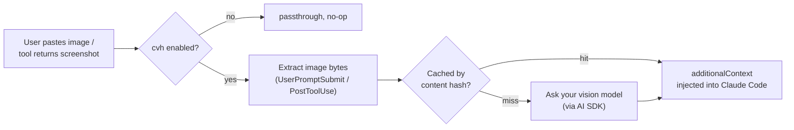

<div align="center">

# cc-vision-hook

**Give vision-blind Claude Code models eyes — without touching your prompt.**

`cvh` is a local-only Claude Code Hook toolkit. When you paste an image, or a tool (`Read` / `Bash` / MCP) produces a screenshot, `cvh` sends it to a vision model of your choice and injects the description back into Claude Code's context as `additionalContext` — so a model that would otherwise silently ignore the image can actually "see" it.

[](https://www.npmjs.com/package/cc-vision-hook)
[](https://www.npmjs.com/package/cc-vision-hook)
[](https://github.com/RainSunMe/cc-vision-hook)
[](./LICENSE)
[](package.json)

[English](./README.md) · [简体中文](./README.zh-CN.md)

</div>

---

## Why

Not every model behind Claude Code understands images. Depending on the backend, an unsupported image request fails in one of two very different ways:

| Failure mode | What happens | Can `cvh` fix it? |
|---|---|---|
| **Silently ignoring** | The API call succeeds (HTTP 200), but the model never actually looks at the image — it guesses, hallucinates, or just says "I can't see the image." | ✅ Yes — this is exactly what `cvh` is built for |
| **Protocol-level hard rejection** | The API call fails outright (e.g. `404 No endpoints found that support image input`), and the *entire* turn fails, text included. | ❌ No — see [Scope & limitations](#scope--limitations) |

`cvh` targets the first case. It never touches the original image content block — it only **appends** a text description generated by a vision model you configure, via Claude Code's `additionalContext` hook output. That's the whole trick: no schema surgery, no risky content replacement, just an honest text description sitting next to the image the main model can't parse.

> ✅ **Verified against a real Claude Code session.** A model that silently ignores images was tested with and without `cvh`: without it, it guessed the wrong color for a test image; with `cvh` installed, the hook transcript shows `additionalContext` being injected and the model answering correctly. See [`CHANGELOG.md`](./CHANGELOG.md) for details.

## How it works



- **`UserPromptSubmit`** hook scans `~/.claude/image-cache/<session_id>/` for newly pasted images.
- **`PostToolUse`** hook (`matcher: "*"`) runs a generic recursive extractor over any tool's `tool_response` — verified against three real, structurally different shapes: `Read`'s discriminated object, MCP's content-block array, and `Bash`/`PowerShell`'s flat `isImage` + data-URI string.
- Both hooks **only ever output `additionalContext`** — never `updatedToolOutput`. This keeps `cvh` simple and safe: no per-tool schema replication, no risk of a silently-dropped hook output because the replacement shape didn't match.
- Vision inference goes through the [Vercel AI SDK](https://sdk.vercel.ai/), so you can point `cvh` at OpenAI (Chat Completions or Responses), Anthropic, or Gemini — or any OpenAI/Anthropic-compatible gateway.
- Descriptions are cached on disk by image content hash (`~/.claude/cc-vision-hook/cache/`), shared globally, with a 7-day lazy-expiring TTL — the same image is only ever described once, no matter where it came from.
- An optional **MCP server** (`cvh mcp install`) exposes `vision_ask` / `vision_describe_image` / `vision_describe_data_url`, so the agent can proactively follow up on an image it already saw ("what does the text in the top-right corner say?") instead of only getting a one-shot description. MCP registration is independent from the `enabled` switch — disabling `cvh` does not uninstall the MCP server, and vice versa.

## Scope & limitations

**`cvh` only helps with models that silently ignore images.** If your model hard-rejects image input at the protocol level (the request itself fails), `cvh` cannot help — it never replaces or removes the original image content block, so the upstream will still see (and reject) it. Run `cvh doctor` or send a manual test request to figure out which category your model falls into before enabling `cvh`.

Other known limitations:

1. Hard-rejection models are out of scope (see above).
2. Support for "user pastes an image" relies on an **unofficial implementation detail** of Claude Code (`~/.claude/image-cache/` directory scanning). This could break in a future Claude Code release; `cvh` does not attempt version detection or graceful degradation.
3. `cvh` does not auto-detect model capabilities. It's a plain `enable`/`disable` switch — you decide when to turn it on.
4. Claude Code only. No support for other agent hosts.
5. Images are sent to whichever third-party vision provider you configure. You are responsible for that data flow — review your provider's data handling policy if your screenshots may contain sensitive information.

## Install

Interactive (recommended for a first-time setup):

```bash
npm install -g cc-vision-hook
cvh init      # asks for provider/model/apiKey, registers hooks, optionally MCP + enable
```

Or non-interactive, e.g. for scripting:

```bash
npm install -g cc-vision-hook

cvh install                            # create config + register hooks (idempotent)
cvh config set provider anthropic      # or: oai / responses / gemini
cvh config set model <your-vision-model>
cvh config set apiKey <your-api-key>
cvh doctor                             # sanity-check config + connectivity
cvh enable
```

## Commands

| Command | Description |
|---|---|
| `cvh init` | Interactive setup wizard (provider/model/apiKey, hooks, optional MCP + enable) |
| `cvh install` | Non-interactive: create config + register hooks (idempotent, safe to re-run) |
| `cvh uninstall [--purge]` | Remove hook + MCP registration; `--purge` also deletes config and cache |
| `cvh enable` / `cvh disable` | The one and only runtime switch |
| `cvh status` | Show current state, hook/MCP registration, cache stats |
| `cvh doctor` | Self-check config / hooks / vision model connectivity, plus a boundary reminder |
| `cvh config get` / `cvh config set <key> <value>` | Read/write config (`provider`/`model`/`baseUrl`/`apiKey`/`timeoutMs`/`maxTokens`) |
| `cvh test-image <path>` | Manually verify the pipeline: local image → vision model → description |
| `cvh mcp install` / `cvh mcp uninstall` / `cvh mcp status` | Register/remove/inspect the optional MCP server (`vision_ask` etc.) |
| `cvh mcp serve` | Run the MCP stdio server (invoked by Claude Code itself, not by hand) |

Every command except `init` supports `--json` output for scripting.

## Configuration

`~/.claude/cc-vision-hook.json`:

```json
{
  "enabled": true,
  "provider": "oai",
  "model": "gpt-4o-mini",
  "baseUrl": "https://api.openai.com/v1",
  "apiKey": "sk-...",
  "timeoutMs": 45000,
  "maxTokens": 1200,
  "cache": { "ttlDays": 7 }
}
```

The API key is stored in plaintext; the file permission is automatically set to `0600` (owner read/write only).

Environment variable overrides (take priority over the config file): `CVH_ENABLED` / `CVH_PROVIDER` / `CVH_MODEL` / `CVH_BASE_URL` / `CVH_API_KEY` / `CVH_TIMEOUT_MS` / `CVH_MAX_TOKENS`.

## MCP tools (optional)

```bash
cvh mcp install     # register the MCP server in ~/.claude.json (independent of `enabled`)
```

This exposes three tools to the agent:

| Tool | Purpose |
|---|---|
| `vision_ask` | Follow up on an image previously seen via a hook or another MCP call, by `image_id` (from the `image_vision`/`tool_image_vision` tag in `additionalContext`). |
| `vision_describe_image` | Describe a local image file directly, without relying on a prior cache hit. |
| `vision_describe_data_url` | Describe an inline `data:image/...;base64,...` URL directly. |

`vision_describe_image`/`vision_describe_data_url` results are cached on disk the same way hook-produced descriptions are, so a later `vision_ask` can follow up on them too.

## Troubleshooting

- **Installed but nothing happens** — Claude Code reads `$HOME/.claude/settings.json` (not `$HOME` itself). Make sure the path `cvh install` wrote to matches the one Claude Code actually loads. Run `cvh status` and confirm both hooks are `true` and `enabled` is `true`.
- **`doctor` reports a connectivity failure** — run `cvh test-image <local-image>` first to isolate whether the problem is in the vision-model call itself or in hook wiring.
- **The model errors out entirely / the whole turn fails when an image is involved** — you're using a hard-rejection model. `cvh` cannot help here; see [Scope & limitations](#scope--limitations).

## Development

```bash
bun install
bun run typecheck   # tsc --noEmit
bun run build       # emit dist/
bun test            # fixture-driven unit tests, no real network calls
```

For local/integration testing, override `~/.claude` with the `CVH_CLAUDE_HOME` environment variable so you never touch your real Claude Code configuration:

```bash
export CVH_CLAUDE_HOME=/tmp/some-isolated-dir/.claude
node dist/cli.js install
```

When wiring this up against a real Claude Code session, set `CVH_CLAUDE_HOME` to `$HOME/.claude` (not `$HOME` itself), and also set `HOME=<isolated dir>` so the `claude` process reads the same `settings.json`.

## Contributing

Issues and PRs are welcome. Please run `bun run ci` (typecheck + test + build) before submitting.

Contributions that add or change behavior should include a [changeset](https://github.com/changesets/changesets):

```bash
bun run changeset
```

## Releasing

Releases are published to npm via [Trusted Publishing](https://docs.npmjs.com/trusted-publishers) (OIDC, no long-lived tokens) whenever a `v*` tag is pushed. See [`docs/releasing.md`](./docs/releasing.md) for the full process and [`docs/release-checklist.md`](./docs/release-checklist.md) for the pre-flight checklist.

## License

[MIT](./LICENSE)
