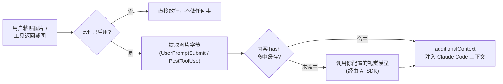

<div align="center">

# cc-vision-hook

**让"看不懂图片"的 Claude Code 模型拥有眼睛——完全不动你的 prompt。**

`cvh` 是一个纯本地运行的 Claude Code Hook 工具集。当你粘贴图片、或某个工具（`Read` / `Bash` / MCP）产出截图时，`cvh` 会把图片发给你自己配置的视觉模型，再把描述文字以 `additionalContext` 的形式注入回 Claude Code 的上下文——让原本"看不懂图片"的主模型也能真正"看到"图片内容。

[](https://www.npmjs.com/package/cc-vision-hook)
[](https://www.npmjs.com/package/cc-vision-hook)
[](https://github.com/RainSunMe/cc-vision-hook)
[](./LICENSE)
[](package.json)

[English](./README.md) · [简体中文](./README.zh-CN.md)

</div>

---

## 为什么需要它

Claude Code 背后接的模型不一定都支持图片。当一个不支持视觉的模型收到图片请求时，通常会出现两种完全不同的失败方式：

| 失败模式 | 表现 | `cvh` 能解决吗 |
|---|---|---|
| **静默忽略** | API 调用成功（HTTP 200），但模型根本没真正理解图片内容——它会瞎猜、幻觉，或者直接说"我看不到图片"。 | ✅ 能——这正是 `cvh` 的目标场景 |
| **协议层硬拒绝** | API 调用直接失败（例如常见的 `404 No endpoints found that support image input`），**整轮对话**都会失败，连文本部分也一起废弃。 | ❌ 不能——见[适用范围与已知限制](#适用范围与已知限制) |

`cvh` 只解决第一种场景。它从不修改原始的图片内容块，只通过 Claude Code 的 `additionalContext` Hook 输出，**追加**一段由你配置的视觉模型生成的文字描述。整个方案就这么简单：不需要精确还原任何工具的输出 schema，不需要冒险替换原始内容，只是在模型看不懂的图片旁边，放一段诚实的文字描述。

> ✅ **已通过真实 Claude Code 会话验证。** 一个"静默忽略图片"型模型分别在装/未装 `cvh` 的情况下测试：未装时，它把测试图片的颜色猜错了；装了 `cvh` 后，Hook 执行记录显示 `additionalContext` 被正确注入，模型给出了正确答案。详见 [`CHANGELOG.md`](./CHANGELOG.md)。

## 工作原理



- **`UserPromptSubmit`** Hook 扫描 `~/.claude/image-cache/<session_id>/` 目录，找出新粘贴的图片。
- **`PostToolUse`** Hook（`matcher: "*"`）用通用递归提取器扫描任意工具的 `tool_response`——已验证覆盖三种结构完全不同的真实样本：`Read` 的判别式对象、MCP 的 content block 数组、`Bash`/`PowerShell` 的扁平 `isImage` 标志 + data URI 字符串。
- 两个 Hook **永远只输出 `additionalContext`**，从不使用 `updatedToolOutput`。这让 `cvh` 保持简单又安全：不需要为每个工具单独复刻输出 schema，也不用担心替换值 shape 不匹配导致 Hook 输出被 Claude Code 静默丢弃。
- 视觉推理统一通过 [Vercel AI SDK](https://sdk.vercel.ai/) 完成，你可以把 `cvh` 指向 OpenAI（Chat Completions 或 Responses）、Anthropic、Gemini，或任何兼容 OpenAI/Anthropic 协议的网关。
- 解析结果按图片内容 hash 缓存在本地磁盘（`~/.claude/cc-vision-hook/cache/`），全局共享，TTL 7 天惰性过期——同一张图无论来自哪里，只会被解析一次。
- 可选的 **MCP server**（`cvh mcp install`）暴露 `vision_ask` / `vision_describe_image` / `vision_describe_data_url` 三个工具，让 Agent 可以对已经看过的图片主动追问（比如"右上角的文字写了什么？"），而不是只能拿到一次性的通用描述。MCP 的注册状态与主开关 `enabled` 完全独立——停用 `cvh` 不会卸载 MCP server，反之亦然。

## 适用范围与已知限制

**`cvh` 只对"静默忽略图片"型模型有效。** 如果你的模型在协议层就直接硬拒绝图片输入（请求本身就失败），`cvh` 无法帮上忙——它从不替换或移除原始的图片内容块，上游依然会看到（并拒绝）它。启用前先跑一下 `cvh doctor` 或手动发一次测试请求，确认你的模型属于哪一类。

其他已知限制：

1. 协议层硬拒绝型模型不在解决范围内（见上）。
2. "用户粘贴图片"场景的支持依赖 Claude Code 的一个**非官方实现细节**（扫描 `~/.claude/image-cache/` 目录）。未来的 Claude Code 版本可能会让这条路径失效；`cvh` 不做版本检测或优雅降级。
3. `cvh` 不会自动判断模型能力，只有简单的 `enable`/`disable` 开关——启用与否由你决定。
4. 仅支持 Claude Code，不支持其他 Agent 宿主。
5. 图片会被发送给你配置的第三方视觉模型服务商，数据流向由你自己负责——如果截图可能包含敏感信息，请自行评估该服务商的数据处理政策。

## 安装

交互式（推荐首次配置时使用）：

```bash
npm install -g cc-vision-hook
cvh init      # 依次询问 provider/model/apiKey，注册 Hook，可选注册 MCP + 启用
```

或非交互式（例如用于脚本化场景）：

```bash
npm install -g cc-vision-hook

cvh install                            # 创建配置 + 注册 Hook（幂等）
cvh config set provider anthropic      # 或 oai / responses / gemini
cvh config set model <你的视觉模型>
cvh config set apiKey <你的-api-key>
cvh doctor                             # 自检配置与连通性
cvh enable
```

## 命令

| 命令 | 说明 |
|---|---|
| `cvh init` | 交互式安装向导（provider/model/apiKey、Hook、可选 MCP + 启用） |
| `cvh install` | 非交互安装：创建配置 + 注册 Hook（幂等，可重复执行） |
| `cvh uninstall [--purge]` | 移除 Hook 与 MCP 注册；`--purge` 连带删除配置和缓存 |
| `cvh enable` / `cvh disable` | 唯一的运行开关 |
| `cvh status` | 查看当前状态、Hook/MCP 注册情况、缓存统计 |
| `cvh doctor` | 自检配置 / Hook / 视觉模型连通性，并提示适用边界 |
| `cvh config get` / `cvh config set <key> <value>` | 读写配置（`provider`/`model`/`baseUrl`/`apiKey`/`timeoutMs`/`maxTokens`） |
| `cvh test-image <path>` | 手动验证：本地图片 → 视觉模型 → 描述文字 |
| `cvh mcp install` / `cvh mcp uninstall` / `cvh mcp status` | 注册/移除/查看可选的 MCP server（`vision_ask` 等） |
| `cvh mcp serve` | 以 stdio 模式运行 MCP server（由 Claude Code 自动调起，不要手动执行） |

除 `init` 外，所有命令均支持 `--json` 输出，方便脚本调用。

## 配置文件

`~/.claude/cc-vision-hook.json`：

```json
{
  "enabled": true,
  "provider": "oai",
  "model": "gpt-4o-mini",
  "baseUrl": "https://api.openai.com/v1",
  "apiKey": "sk-...",
  "timeoutMs": 45000,
  "maxTokens": 1200,
  "cache": { "ttlDays": 7 }
}
```

API Key 以明文存储，文件权限会自动设为 `0600`（仅当前用户可读写）。

环境变量覆盖（优先级高于配置文件）：`CVH_ENABLED` / `CVH_PROVIDER` / `CVH_MODEL` / `CVH_BASE_URL` / `CVH_API_KEY` / `CVH_TIMEOUT_MS` / `CVH_MAX_TOKENS`。

## MCP 工具（可选）

```bash
cvh mcp install     # 注册 MCP server 到 ~/.claude.json（与 enabled 开关无关）
```

会向 Agent 暴露三个工具：

| 工具 | 用途 |
|---|---|
| `vision_ask` | 按 `image_id`（来自 `additionalContext` 里的 `image_vision`/`tool_image_vision` 标签）追问此前已看过的图片。 |
| `vision_describe_image` | 直接解析一张本地图片文件，不依赖历史缓存命中。 |
| `vision_describe_data_url` | 直接解析一个内联的 `data:image/...;base64,...` URL。 |

`vision_describe_image`/`vision_describe_data_url` 的解析结果会按 Hook 同样的方式落盘缓存，方便后续用 `vision_ask` 继续追问。

## 排障

- **装了但看起来没生效**：Claude Code 读取的是 `$HOME/.claude/settings.json`（不是 `$HOME` 本身），确认 `cvh install` 写入的路径和 Claude Code 实际加载的路径一致。用 `cvh status` 确认两个 Hook 均为 `true`，`enabled` 为 `true`。
- **`doctor` 报连通性失败**：先用 `cvh test-image <本地图片>` 单独验证视觉模型调用链路，排除 Hook 集成层面的问题。
- **模型收到图片直接报错、整轮对话失败**：说明你用的是「协议层硬拒绝」型模型，`cvh` 对此无效，见[适用范围与已知限制](#适用范围与已知限制)。

## 开发

```bash
bun install
bun run typecheck   # tsc --noEmit
bun run build       # 产出 dist/
bun test            # fixture 驱动的单测，不发真实网络请求
```

本地/集成测试时，可用 `CVH_CLAUDE_HOME` 环境变量覆盖 `~/.claude` 根目录，避免影响你真实的 Claude Code 配置：

```bash
export CVH_CLAUDE_HOME=/tmp/some-isolated-dir/.claude
node dist/cli.js install
```

如果要联调真实的 Claude Code 会话，需要把 `CVH_CLAUDE_HOME` 设为 `$HOME/.claude`（不是 `$HOME` 本身），同时设置 `HOME=<隔离目录>`，这样 `claude` 进程才会读到同一份 `settings.json`。

## 贡献

欢迎提交 Issue 和 PR。提交前请先跑通 `bun run ci`（typecheck + test + build）。

涉及行为变更的贡献请附带一个 [changeset](https://github.com/changesets/changesets)：

```bash
bun run changeset
```

## 发布

发布通过 npm [Trusted Publishing](https://docs.npmjs.com/trusted-publishers)（基于 OIDC，不存任何长期 token）完成，推送 `v*` tag 即触发。完整流程见 [`docs/releasing.md`](./docs/releasing.md)，发布前检查清单见 [`docs/release-checklist.md`](./docs/release-checklist.md)。

## 许可证

[MIT](./LICENSE)
